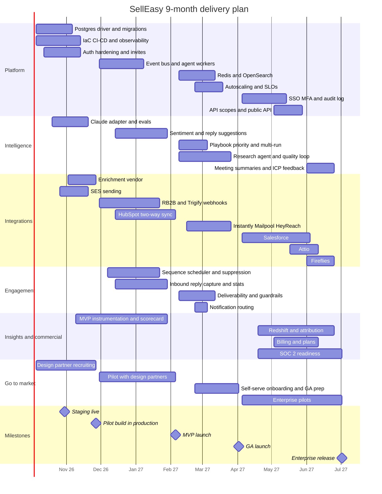
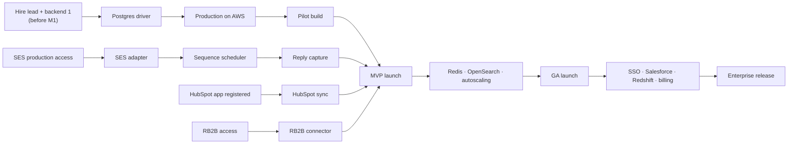

The timeline turns the four phases into calendar months. Owners are **roles** (see [Team plan](/docs/team-and-cost/team-plan)); assign names when the team is hired. Dates are planning estimates, and a two-week holiday buffer is built into December–January.

## Month by month

| Month | Dates | Phase | Key work | Milestones | Owner(s) | Depends on |
|---|---|---|---|---|---|---|
| **M1** | Oct 2026 | 1 | Postgres driver; IaC and staging; CI/CD; provider plumbing; auth hardening starts; Claude adapter starts; design-partner outreach | **Staging live** (30 Oct) | Lead eng, Backend 1, DevOps, PM | AWS accounts; lead engineer and backend 1 in seat |
| **M2** | Nov 2026 | 1 | Migrations and data move; production; observability; SES; enrichment adapter; invite emails; pilot readiness | **Pilot build in production** (27 Nov); pilot gate | Lead eng, Backend 1–2, Integrations, DevOps, ML | SES production access; enrichment vendor sandbox; backend 2 and integrations hired |
| **M3** | Dec 2026 | 2 | Event bus and agent workers; webhook framework; RB2B; scheduler starts; inbound capture starts; HubSpot app starts | Design partners onboarded (3+) | Lead eng, Backend 1–2, Integrations | RB2B partner access; HubSpot developer app registered |
| **M4** | Jan 2027 | 2 | Trigify; scheduler, suppression and stats complete; decay job; HubSpot sync complete; instrumentation; pen test; launch hardening | **MVP launch** (5 Feb); MVP gate | Whole team; QA to 1.0 | Pen test vendor booked; 5+ partners active |
| **M5** | Feb 2027 | 3 | Redis; search; playbook priority; research agent; deliverability; Instantly / Mailpool; notification routing | Paying design partners | Backend 1–2, Integrations, ML, DevOps; GTM joins | Instantly / Mailpool accounts; research data source contracts |
| **M6** | Mar 2027 | 3 | HeyReach; auto-send guardrails; onboarding; autoscaling and SLOs; data integrity; remove simulation; GA readiness | **GA launch** (2 Apr); GA gate | Whole team | SLOs met 4 weeks; pricing agreed |
| **M7** | Apr 2027 | 4 | SSO and MFA; audit log; Salesforce starts; Redshift pipeline starts; SOC 2 readiness starts | First enterprise pilot | Backend 1–2, Integrations, Lead eng, DevOps | IdP decision (ADR-12); compliance platform contract |
| **M8** | May 2027 | 4 | API scopes; Salesforce continues; Attio; billing; attribution starts | Billing in staging | Backend 1–2, Integrations, Frontend, PM | Billing provider account; Salesforce connected app |
| **M9** | Jun 2027 | 4 | Salesforce complete; attribution and ROI; Fireflies; SOC 2 evidence; enterprise hardening | **Enterprise release** (2 Jul); enterprise gate | Whole team | SOC 2 auditor booked; AppExchange review submitted |

## Full Gantt

## Milestones

| Milestone | Target date | Definition | Accountable |
|---|---|---|---|
| Kickoff | 5 Oct 2026 | Team in place for Phase 1 (at least lead engineer, backend 1, frontend, PM) | Founders |
| Staging live | 30 Oct 2026 | Staging on AWS with Postgres, deployed by CI | Lead engineer |
| Pilot build in production | 27 Nov 2026 | [Phase 1 exit criteria](/docs/roadmap/phase-1-foundation#exit-criteria-pilot-gate) met | Lead engineer + PM |
| MVP launch | 5 Feb 2027 | [Phase 2 exit criteria](/docs/roadmap/phase-2-real-integrations#exit-criteria-mvp-launch-gate) met | PM |
| GA launch | 2 Apr 2027 | [Phase 3 exit criteria](/docs/roadmap/phase-3-scale-and-intelligence#exit-criteria-ga-gate) met | Founders + PM |
| Enterprise release | 2 Jul 2027 | [Phase 4 exit criteria](/docs/roadmap/phase-4-enterprise-and-analytics#exit-criteria-enterprise-gate) met | Founders + lead engineer |

## Critical path

Slippage on any node of this chain moves the MVP launch. Items off the chain (Trigify, second enrichment vendor, Bombora) can slip without moving it.

## Related

- [Roadmap overview](/docs/roadmap)
- [Dependencies & risks](/docs/roadmap/dependencies-and-risks)
- [Total budget → month-by-month burn](/docs/team-and-cost/total-budget#month-by-month-burn)
