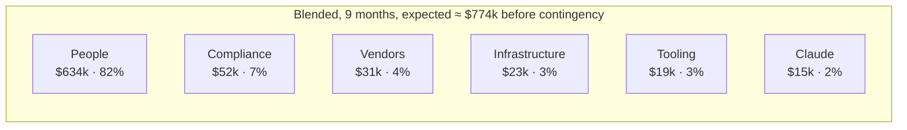

This tab estimates **who** is needed to deliver the [roadmap](/docs/roadmap) and **what it costs**. The figures are planning estimates for founders and budget holders, not quotes.

<Callout type="warn" title="Estimates, not quotes">
All figures are in **US dollars** and are **estimates**. Salaries vary by city and seniority. Vendor prices change often, and many vendors (Bombora, Apollo enterprise, Clearbit / HubSpot Breeze, RB2B, HeyReach, Instantly, Mailpool, Fireflies) are quote-based or tiered, so **verify with each vendor**. LLM prices are assumptions — **check current Anthropic pricing**. Every assumption is listed in [Assumptions](/docs/team-and-cost/assumptions).
</Callout>

## Recommended team by phase

| Role | Phase 1 (M1–2) | Phase 2 (M3–4) | Phase 3 (M5–6) | Phase 4 (M7–9) |
|---|:-:|:-:|:-:|:-:|
| Founding / lead engineer | 1 | 1 | 1 | 1 |
| Backend engineers | 1 → 2 | 2 | 2 | 2 |
| Frontend engineer | 1 | 1 | 1 | 1 |
| Full-stack / integrations engineer | 0 → 1 | 1 | 1 | 1 |
| ML / LLM engineer | 0.5 | 0.5 | 0.5 | 0.5 |
| DevOps / SRE (fractional) | 0.5 | 0.5 | 0.5 | 0.5 |
| QA engineer | 0 → 0.5 | 0.5 → 1 | 1 | 1 |
| Product manager | 1 | 1 | 1 | 1 |
| Product designer (part-time) | 0.5 | 0.5 | 0.5 | 0.5 |
| GTM / solutions engineer | — | — | 1 | 1 |
| **Total FTE** | **5.5 → 8.0** | **8.0 → 8.5** | **9.5** | **9.5** |

Details, hiring order and a lean alternative: [Team plan](/docs/team-and-cost/team-plan).

## Headline budget

Three staffing models are compared: **US-heavy** (whole team in the US), **India-heavy** (whole team in India) and **Blended** (lead engineer, PM and GTM in the US; everyone else in India). Totals include people, infrastructure, vendors, AI, tooling and compliance, **plus 12.5% contingency**.

| Scenario | 6 months (to GA) — expected | 6 months — range | 9 months (to enterprise release) — expected | 9 months — range |
|---|--:|--:|--:|--:|
| **US-heavy** | **$1.04M** | $0.88M – $1.22M | **$1.69M** | $1.42M – $2.02M |
| **Blended** | **$0.51M** | $0.41M – $0.64M | **$0.87M** | $0.69M – $1.11M |
| **India-heavy** | **$0.29M** | $0.22M – $0.40M | **$0.51M** | $0.37M – $0.72M |

### Where the money goes (expected, before contingency)

| Cost line | 6 months | 9 months | Share of blended 9-month total | Detail |
|---|--:|--:|--:|---|
| People — US-heavy | $866k | $1,361k | — | [People cost](/docs/team-and-cost/people-cost) |
| People — Blended | $398k | $634k | 82% | |
| People — India-heavy | $203k | $317k | — | |
| AWS + Vercel (all environments) | $10.6k | $22.6k | 3% | [Infrastructure cost](/docs/team-and-cost/infrastructure-cost) |
| Data, intent, outreach and CRM vendors (dev, sandbox, pilot) | $16.0k | $31.0k | 4% | [Vendor & AI cost](/docs/team-and-cost/vendor-and-ai-cost) |
| Anthropic Claude usage | $5.5k | $14.5k | 2% | |
| Tooling (GitHub, Linear, Figma, Sentry, …) | $12.2k | $19.4k | 3% | |
| Security and compliance (pen test, SOC 2 readiness) | $12.0k | $52.0k | 7% | [Total budget](/docs/team-and-cost/total-budget) |
| **Non-people subtotal** | **$56k** | **$140k** | **18%** | |

## Key assumptions

- Work starts **5 October 2026**; month 1 = October 2026; the team ramps as in [Team plan](/docs/team-and-cost/team-plan).
- Salaries are **fully loaded** (base + benefits, payroll taxes, equipment, recruiting amortised). US at US-market senior rates; India at Bengaluru / Pune product-company rates converted at **₹85 = $1**.
- Customers **bring their own vendor keys** for data and outreach tools; SellEasy pays only for development, sandbox and pilot usage of those tools, plus platform-owned services (AWS, Claude).
- AWS region **us-east-1**, on-demand pricing, no Savings Plans during the build.
- LLM prices: Claude Opus 5 $5 / $25, Claude Sonnet 5 $2 / $10, Claude Haiku 4.5 $1 / $5 per million input / output tokens — **assumption, check current Anthropic pricing**.
- Revenue is **not** netted off; these are gross costs.

Full list and sensitivity: [Assumptions](/docs/team-and-cost/assumptions).

## Pages in this tab

<Cards>
  <Card title="Team plan" href="/docs/team-and-cost/team-plan" description="Roles, responsibilities, FTE by month, hiring sequence and a lean option." />
  <Card title="People cost" href="/docs/team-and-cost/people-cost" description="Monthly and total cost by role, US vs India, blended, contractors vs FTE." />
  <Card title="Infrastructure cost" href="/docs/team-and-cost/infrastructure-cost" description="AWS and Vercel per environment at MVP and growth scale." />
  <Card title="Vendor & AI cost" href="/docs/team-and-cost/vendor-and-ai-cost" description="Data, intent, outreach and CRM vendors, the Claude usage model and tooling." />
  <Card title="Total budget" href="/docs/team-and-cost/total-budget" description="Consolidated 6- and 9-month budgets, monthly burn and contingency." />
  <Card title="Assumptions" href="/docs/team-and-cost/assumptions" description="Every assumption, how to update the model, and what moves the total most." />
</Cards>
