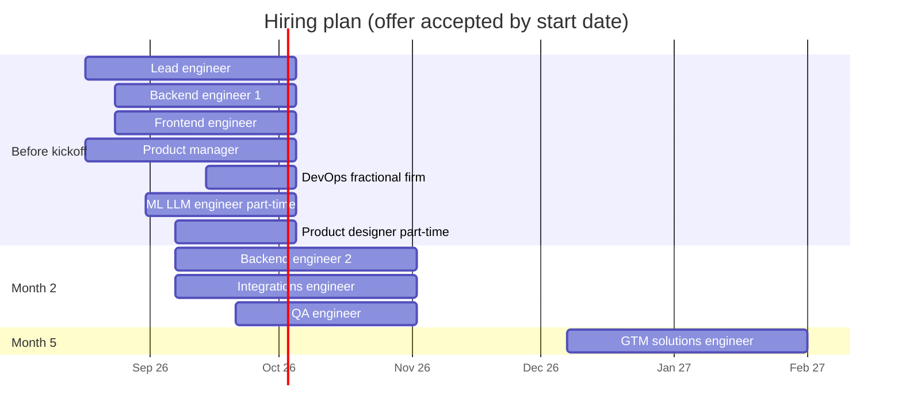

The recommended team peaks at **9.5 FTE**. It is sized for the scope in the [roadmap](/docs/roadmap): mostly integration and platform work on top of a product that is already built. Costs for each role are in [People cost](/docs/team-and-cost/people-cost).

## Roles and responsibilities

| Role | Seniority | Responsibilities | Key skills | Phases most needed |
|---|---|---|---|---|
| **Founding / lead engineer** | Staff / principal | Architecture and ADRs; code reviews; provider plumbing; event bus, HubSpot and warehouse design; SOC 2 technical controls; on-call lead | TypeScript, Node, Postgres, AWS, distributed systems, security | All |
| **Backend engineer 1** | Senior | Postgres driver and migrations; agent workers; inbound capture; stats; cache; audit log; API scopes | TypeScript, SQL, queues, testing | All |
| **Backend engineer 2** | Senior / mid | Auth hardening; SES; sequence scheduler; suppression; search; deliverability; SSO; billing | TypeScript, email infrastructure, identity, scheduling | 1 (from M2) → 4 |
| **Frontend engineer** | Senior | Auth flows; onboarding; integration setup (OAuth, secrets); playbook ordering; analytics and admin UIs; keeps mock mode in sync | Next.js, React, TanStack Query, shadcn/ui, accessibility | All |
| **Full-stack / integrations engineer** | Senior | Enrichment, RB2B, Trigify, Bombora, HubSpot, Instantly, Mailpool, HeyReach, Salesforce, Attio, Fireflies adapters; webhook framework; fixtures | REST / GraphQL APIs, OAuth, webhooks, data mapping | 1 (from M2) → 4 |
| **ML / LLM engineer** (0.5) | Senior | Prompt design; evaluation sets; model choice per task; sentiment; research agent; call summaries; cost per task | LLM APIs (Claude), evals, retrieval, prompt caching | All |
| **DevOps / SRE** (0.5, fractional) | Senior | AWS accounts; Terraform or CDK; CI/CD; observability; queues; autoscaling; Redshift; backups; compliance tooling | AWS, IaC, GitHub Actions, Datadog / CloudWatch | All, heaviest in 1 and 4 |
| **QA engineer** | Mid / senior | Test plans from acceptance criteria; Playwright suite; scheduling and time-zone tests; regression; release sign-off | Playwright, API testing, test design | 2 → 4 |
| **Product manager** | Senior | Design partners; MVP scope; acceptance criteria; instrumentation; scorecards; pricing and packaging; SOC 2 project | B2B SaaS, GTM tools, analytics | All |
| **Product designer** (0.5) | Senior | Onboarding; approval queue; integration setup; playbook builder; analytics and admin | Product design, Figma, design systems (shadcn) | All |
| **GTM / solutions engineer** | Mid / senior | Customer onboarding; demos (mock-mode environment); help centre; security questionnaires; enterprise pilots | Sales engineering, RevOps, HubSpot / Salesforce admin | 3 → 4 |

Not in the core team but budgeted elsewhere: **penetration testers** and **SOC 2 auditors** (in [Total budget](/docs/team-and-cost/total-budget)), and optional **contractors** for peaks (see [People cost](/docs/team-and-cost/people-cost#contractors-vs-full-time)).

## FTE by month

| Role | M1 Oct | M2 Nov | M3 Dec | M4 Jan | M5 Feb | M6 Mar | M7 Apr | M8 May | M9 Jun | FTE-months (6 / 9) |
|---|:-:|:-:|:-:|:-:|:-:|:-:|:-:|:-:|:-:|:-:|
| Lead engineer | 1 | 1 | 1 | 1 | 1 | 1 | 1 | 1 | 1 | 6 / 9 |
| Backend engineers | 1 | 2 | 2 | 2 | 2 | 2 | 2 | 2 | 2 | 11 / 17 |
| Frontend engineer | 1 | 1 | 1 | 1 | 1 | 1 | 1 | 1 | 1 | 6 / 9 |
| Integrations engineer | 0 | 1 | 1 | 1 | 1 | 1 | 1 | 1 | 1 | 5 / 8 |
| ML / LLM engineer | 0.5 | 0.5 | 0.5 | 0.5 | 0.5 | 0.5 | 0.5 | 0.5 | 0.5 | 3 / 4.5 |
| DevOps / SRE | 0.5 | 0.5 | 0.5 | 0.5 | 0.5 | 0.5 | 0.5 | 0.5 | 0.5 | 3 / 4.5 |
| QA engineer | 0 | 0.5 | 0.5 | 1 | 1 | 1 | 1 | 1 | 1 | 4 / 7 |
| Product manager | 1 | 1 | 1 | 1 | 1 | 1 | 1 | 1 | 1 | 6 / 9 |
| Product designer | 0.5 | 0.5 | 0.5 | 0.5 | 0.5 | 0.5 | 0.5 | 0.5 | 0.5 | 3 / 4.5 |
| GTM / solutions | 0 | 0 | 0 | 0 | 1 | 1 | 1 | 1 | 1 | 2 / 5 |
| **Total** | **5.5** | **8.0** | **8.0** | **8.5** | **9.5** | **9.5** | **9.5** | **9.5** | **9.5** | **49 / 77.5** |

Engineering capacity (excluding PM, design and GTM) is 4.0 FTE in month 1, 6.5 in months 2–3, 7.0 from month 4.

## Hiring sequence

Bars show the recruiting window leading to each start date. If recruiting starts later than shown, use contractors for the Postgres driver and first adapters (see [Dependencies & risks → hiring](/docs/roadmap/dependencies-and-risks#hiring-dependencies)).

**Order of priority:** lead engineer → backend 1 → PM → frontend → DevOps (fractional) → ML/LLM → designer → backend 2 → integrations → QA → GTM.

## Team shape over time

```mermaid
flowchart LR
  subgraph P1["Phase 1 · 5.5–8 FTE"]
    a1["Platform core<br/>lead · backend 1 · DevOps"]
    a2["First adapters<br/>ML · backend 2 · integrations"]
    a3["Pilot<br/>PM · frontend · designer"]
  end
  subgraph P2["Phase 2 · 8–8.5 FTE"]
    b1["Loop squad<br/>scheduler · inbound · agent workers"]
    b2["Integrations squad<br/>webhooks · HubSpot"]
    b3["Launch<br/>QA · PM"]
  end
  subgraph P3["Phase 3 · 9.5 FTE"]
    c1["Scale<br/>cache · search · SLOs"]
    c2["Intelligence<br/>research · playbooks"]
    c3["Channels + GA<br/>deliverability · HeyReach · GTM"]
  end
  subgraph P4["Phase 4 · 9.5 FTE"]
    d1["Enterprise<br/>SSO · audit · SOC 2"]
    d2["CRM<br/>Salesforce · Attio"]
    d3["Insights + commercial<br/>Redshift · billing · Fireflies"]
  end
  P1 --> P2 --> P3 --> P4
```

## Alternative: lean team

For a tighter budget, a **lean team of about 4.75 FTE** can deliver the same scope more slowly.

| Role | Lean FTE | Notes |
|---|:-:|---|
| Founding / lead engineer | 1 | Also owns DevOps decisions |
| Backend engineer | 1 | |
| Full-stack / integrations engineer | 1 | Takes scheduler and adapters |
| Frontend engineer | 0.5 | Contractor or part-time |
| ML / LLM engineer | 0.25 | Advisor / contractor |
| DevOps | 0.25 | Fractional firm, setup-heavy |
| Product manager | 0.5 | Founder covers the rest |
| Designer | 0.25 | Contractor |
| QA, GTM | 0 | Engineers own tests; founders sell and onboard |

| Lean team | Monthly people cost (expected) | 9 months of people cost |
|---|--:|--:|
| US-heavy | ~$87.7k | ~$789k |
| Blended (lead + PM in US) | ~$43.2k | ~$388k |
| India-heavy | ~$21.3k | ~$192k |

**Trade-offs**

- Timeline stretches to roughly **13–15 months** for the full 9-month scope: MVP launch around month 6, GA around month 9, Phase 4 largely beyond.
- Higher key-person risk; little room for design-partner support.
- Recommended scope cuts: drop Bombora, Attio, Fireflies and the second enrichment vendor; delay OpenSearch; keep SOC 2 to readiness only.

## Working model

- Two-week sprints; phase gates as in [Dependencies & risks](/docs/roadmap/dependencies-and-risks#decision-points-and-go--no-go-gates).
- For blended teams, keep a **daily overlap of at least 2–3 hours** between US and India time zones; the lead engineer and PM own cross-time-zone hand-offs.
- Every epic has one owning engineer; the lead engineer reviews architecture-affecting changes.
- On-call rotation starts at the pilot gate with the lead engineer, backend engineers and DevOps.
