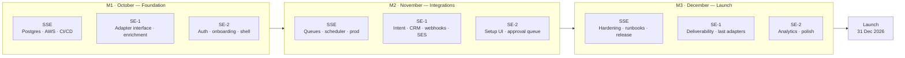

The team is **three engineers, all in India, for 13 weeks** (5 October – 31 December 2026). Costs are in [People cost](/docs/team-and-cost/people-cost); what they deliver is in the [roadmap](/docs/roadmap).

| Role | Who | Primary ownership |
|---|---|---|
| **SSE** — Senior Software Engineer, tech lead | 1 person, ₹22L CTC | Data layer, AWS, CI/CD, architecture calls, code review, release, on-call |
| **SE-1** — Software Engineer, integrations | 1 person, ₹12L CTC | Vendor adapters, webhooks, scheduling, email sending, sync logs |
| **SE-2** — Software Engineer, product surface | 1 person, ₹12L CTC | Next.js app, onboarding, approval queue, analytics views, mock-mode parity |

The founder acts as product manager: scope, acceptance criteria, design-partner conversations and prioritisation. There is no designer, no DevOps engineer and no QA engineer — see [What this team does not cover](#what-this-team-does-not-cover).

## Responsibilities in detail

<Accordions>
<Accordion title="SSE — Senior Software Engineer (tech lead)">

**Owns**

- The `PostgresRepository` driver, the schema, migrations and the JSON-to-Postgres migration script
- AWS account structure, VPC, ECS/App Runner services, RDS, Secrets Manager, KMS, CloudWatch, SES domain and DKIM setup
- Infrastructure-as-code (Terraform or CDK), GitHub Actions pipelines, environment promotion
- Auth hardening: token handling, rate limiting behind a proxy, encryption key management
- Architecture decisions and the review queue — **every** pull request that touches data, security or the event flow
- Release management, the production checklist in [Deployment](/docs/engineering/deployment), and being the escalation point during the launch window

**Does not own:** UI work, or more than one vendor adapter. If the SSE is writing adapters, the plan is off track.

**Key skills:** TypeScript, Node, PostgreSQL, AWS, IaC, security fundamentals, and enough judgement to say no to scope.

</Accordion>
<Accordion title="SE-1 — Software Engineer, integrations">

**Owns**

- One adapter per vendor against the interfaces in [Integrations landscape](/docs/architecture/integrations-landscape): enrichment, intent (RB2B, Trigify), CRM (HubSpot), outreach (Instantly or Mailpool), LinkedIn (HeyReach)
- The webhook receiver framework: signature verification, idempotency, replay, dead-letter handling
- Per-workspace credential storage and the sync-log surface behind it
- Sequence scheduling and SES sending, including suppression and bounce handling
- Recorded HTTP fixtures so every adapter has a test that runs without network access

**Key skills:** REST and OAuth integration work, data mapping, retry and idempotency patterns, patience with badly documented vendor APIs.

</Accordion>
<Accordion title="SE-2 — Software Engineer, product surface">

**Owns**

- Auth and onboarding flows in the Next.js app
- Integration setup UI: connect, enter credentials, show sync status and errors
- The approval queue — the screen the product lives or dies on
- Analytics and admin views against the real API
- Keeping mock data mode in step with the backend (`npm run mock:check` in CI), because the stakeholder demo depends on it — see [Environments & data modes](/docs/architecture/environments-and-data-modes)
- Accessibility and responsive behaviour, in the absence of a designer

**Key skills:** Next.js, React, TanStack Query, shadcn/ui, and enough design sense to ship a clean screen without a Figma file.

</Accordion>
</Accordions>

## Ownership by roadmap month

| Roadmap month | SSE | SE-1 | SE-2 |
|---|---|---|---|
| **[M1 · Foundation](/docs/roadmap/month-1-foundation)** (Oct) | Postgres driver, schema, migration script; AWS accounts, VPC, RDS, ECS/App Runner; CI/CD; staging up by week 3 | Adapter interface and the first enrichment adapter; fixture harness; helps land the Postgres repository tests | Auth flows, onboarding, app shell against the real API; mock parity; first pass on the approval queue |
| **[M2 · Integrations](/docs/roadmap/month-2-integrations)** (Nov) | Event bus and queue workers, scheduler, observability, secrets rotation, production environment; reviews (heaviest month for review load) | Intent and CRM adapters, webhook framework, SES sending and suppression, sync logs | Integration setup UI, approval queue depth, signal and account views, error states |
| **[M3 · Launch](/docs/roadmap/month-3-launch)** (Dec) | Performance and hardening, backups and restore drill, runbooks, release; on-call through the launch window | Remaining adapters, deliverability and warm-up, end-to-end flows against sandboxes | Analytics views, polish, empty and failure states, [launch checklist](/docs/mvp-scope/launch-checklist) items |

In the **final two weeks of December** all three engineers move onto test, bug-fix and launch readiness. No new feature work is planned after roughly 15 December; this is deliberate, and it is the first thing to defend when scope pressure arrives.

## Capacity model

**Gross capacity:** 3 engineers × 13 weeks = **39 engineer-weeks**. Week 13 (28–31 Dec) is partial, and the last week of December is low-output in practice.

| Deduction | Engineer-weeks | Basis |
|---|--:|---|
| Gross capacity | **39.0** | 3 × 13 weeks |
| Onboarding and ramp | −1.5 | Half a week each: environment setup, codebase orientation, access |
| Public holidays | −3.0 | Roughly 4–5 holidays in Oct–Dec including the Dussehra–Diwali cluster and Christmas — **confirm against the 2026 calendar for your state** |
| Planned leave | −2.0 | 3 days per engineer; the festival season makes zero leave unrealistic |
| Year-end drag (week 13) | −1.0 | Partial final week and reduced output around the holidays |
| **Net available** | **31.5** | |
| Non-feature overhead (15%) | −4.7 | Reviews, standups, interviews, incident response, documentation, vendor support tickets |
| **Net feature capacity** | **≈ 26.8 → 27 engineer-weeks** | |

**Read that number carefully.** Twenty-seven engineer-weeks is what the roadmap has to fit into. Each of the three roadmap months carries roughly **9 engineer-weeks** of feature work. Estimate epics in those units, not in calendar time.

<Callout type="warn" title="The capacity model has no slack in it">
Net feature capacity is already after overhead, but it assumes nobody is sick for a week, nobody resigns, and no vendor blocks an adapter for five days. The 12.5% [contingency](/docs/team-and-cost/total-budget#contingency) is the money answer to that; the scope answer is in [Dependencies & risks](/docs/roadmap/dependencies-and-risks).
</Callout>

## How AI assistance changes throughput

AI pair programming is a load-bearing assumption in this plan, so it deserves a number rather than enthusiasm. Every engineer has a paid Claude Code seat, budgeted in [Vendor & AI cost](/docs/team-and-cost/vendor-and-ai-cost#ai-assisted-development-tooling).

| Kind of work | Share of this scope | Assumed multiplier | Why |
|---|--:|:-:|---|
| Mechanical and repetitive — adapters against a documented API, CRUD endpoints, migrations, fixtures, unit tests, type definitions, docs | ~50% | **1.4–1.8×** | The pattern is established after the first example; the model reproduces it faster than a person types it |
| Semi-novel — UI screens from a description, query optimisation, refactors, wiring a new queue worker | ~30% | **1.2–1.4×** | Good first drafts, meaningful review time |
| Genuinely hard — schema and architecture design, debugging a production incident, an undocumented or flaky vendor API, security decisions, deliverability | ~20% | **1.0–1.1×** | The bottleneck is understanding the problem, not producing code |

Weighted, that is roughly a **1.25–1.35× overall multiplier**: the 27 engineer-weeks of this team behave like about **34–36 conventional engineer-weeks**. That is the difference between "impossible in three months" and "tight but achievable" — it is not the difference between three engineers and nine.

**What it does not do**

- It does not reduce review time. It increases it. More code arrives per day and it all still needs a human owner. The 15% overhead above is set higher than a non-AI team's precisely for this.
- It does not shorten waiting. Vendor approvals, DNS and domain warm-up, security reviews and RDS restores take the same wall-clock time.
- It does not remove the need for someone who understands the system. The main quality risk is **code nobody on the team can explain**.

**Mitigations, which are not optional**

<Steps>
<Step>
**Every pull request has a named human owner** who can explain every line in review. "Claude wrote it" is not an answer.
</Step>
<Step>
**The SSE reviews everything touching data, auth, money or the event flow**, regardless of who or what wrote it.
</Step>
<Step>
**Tests are written or reviewed by a different person than the implementation** where the change is risky. AI-generated tests that assert the implementation rather than the behaviour are the common failure.
</Step>
<Step>
**Architecture and schema decisions are made by humans first**, then implemented with assistance — never the other way round. Record them as decisions ([Decisions](/docs/architecture/decisions)).
</Step>
</Steps>

## What this team does not cover

| Gap | Risk | Mitigation in this plan |
|---|---|---|
| **No dedicated QA** | Regressions reach the pilot; no independent sign-off on acceptance criteria | Engineers write tests for their own work; cross-review of tests on risky changes; a Playwright smoke suite in CI; the last two weeks of December reserved for test and bug-fix; the founder runs acceptance against [MVP scope](/docs/mvp-scope/acceptance-criteria) |
| **No designer** | Inconsistent, engineer-designed UI; the approval queue is the product and it will look it | Stay inside shadcn/ui defaults and existing patterns; no bespoke components; a half-day design review with the founder per month; budget a contract designer for 5–10 days if the pilot flags it |
| **No DevOps engineer** | Single point of failure in the SSE; IaC quality risk | SSE owns infrastructure from day one and writes it as code, not console clicks; runbooks in the repo; both SEs must be able to deploy and roll back by end of month 2 |
| **No 24×7 on-call** | Overnight outages go unnoticed during a pilot | Business-hours support only, stated to pilot customers in writing; CloudWatch alarms to Slack and a phone; the SSE is the single escalation point; accept it — do not pretend otherwise |
| **No dedicated PM** | Scope drift, or a founder too busy to unblock the team | Founder commits to a fixed weekly slot for acceptance and decisions; scope is frozen per month; anything new goes to [Beyond the MVP](/docs/roadmap/beyond-the-mvp) |
| **No security specialist** | Unreviewed auth and secrets handling going to a pilot | Follow the production checklist in [Deployment](/docs/engineering/deployment); use managed services (Secrets Manager, KMS, RDS encryption); budget an external review **after** this window, not inside it |
| **Bus factor of one on infrastructure** | If the SSE is unavailable, nothing ships | Everything in IaC and in the repo; both SEs shadow one deploy each in month 2; credentials in a shared vault, never on one laptop |

<Callout type="warn" title="The honest version">
A three-person team with no QA and no design will ship a working pilot, not a polished product. Plan for visible rough edges in the UI and for at least one regression reaching a pilot customer. The alternative — staffing QA and design properly — costs more than this entire budget's contingency, and is the right call only once there are customers to protect.
</Callout>

## What a fourth hire would unlock

If budget allows, a **fourth Software Engineer at ₹12L CTC** is the highest-value addition. Cost: **₹3,00,000** of salary over three months plus roughly **₹1,50,000** of laptop, AI seat and tooling — about **₹4.5L all in**, or **+23%** on the expected total.

| Fourth hire | Adds | Best when |
|---|---|---|
| **SE-3, second integrations engineer** | ~10.5 net engineer-weeks; a parallel adapter track, so CRM and outreach do not queue behind intent; removes the biggest schedule dependency in month 2 | The pilot customers need more than three vendors connected |
| **SE-3, frontend-weighted** | Frees SE-2 to go deep on the approval queue and analytics; noticeably better UI polish | The pilot is design-partner facing and the demo matters commercially |
| **QA engineer (mid-level, ~₹8–10L CTC)** | Independent test design, a real regression suite, release sign-off | You expect to keep shipping after December and want a safety net from the start |
| **Contract designer (10–15 days)** | Approval queue, onboarding and analytics screens designed properly, at roughly ₹1.5L–₹3L | Cheapest meaningful quality win; see [contractor rates](/docs/team-and-cost/people-cost#contractor-alternative) |

A fourth engineer adds about **33% capacity** but not 33% output — onboarding, coordination and review load eat some of it, and the SSE's review time is already the tightest constraint. Hiring a fourth person **after** week 4 gives back less than half the capacity for most of the cost.

## Working model

- **Weekly cycles, not two-week sprints.** Thirteen weeks is too short for fortnightly planning to give useful feedback.
- **One owner per epic.** No shared ownership of an adapter or a screen.
- **Daily 15-minute standup**, written where possible; the team is in one time zone, so use that advantage rather than adding meetings.
- **Monthly scope freeze.** The scope for each roadmap month is fixed on its first working day. New requests go to the next month or to [Beyond the MVP](/docs/roadmap/beyond-the-mvp).
- **Go / no-go gate at the end of each month**, run against [Dependencies & risks](/docs/roadmap/dependencies-and-risks).

## Related

- [People cost](/docs/team-and-cost/people-cost) — what this team costs
- [Roadmap → Timeline](/docs/roadmap/timeline) — the 13-week schedule
- [Total budget](/docs/team-and-cost/total-budget) — the consolidated number
