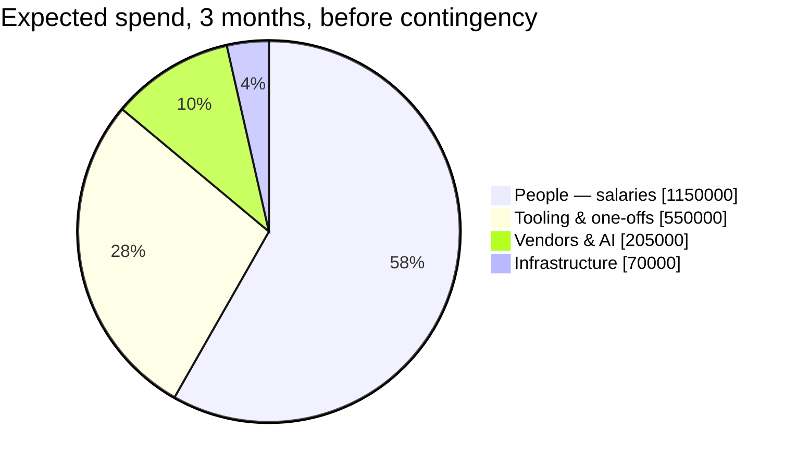
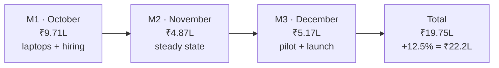

Everything added up: [people](/docs/team-and-cost/people-cost), [infrastructure](/docs/team-and-cost/infrastructure-cost), [vendors and AI](/docs/team-and-cost/vendor-and-ai-cost), and the one-off costs of starting a team. Window: **5 October – 31 December 2026**, delivering the [roadmap](/docs/roadmap).

<Callout type="warn" title="How to read low and high">
**Low** and **high** combine the low or high end of every line at once. They are a plausible band, not independent best and worst cases — everything landing at the high end simultaneously is unlikely. **Expected** is the number to plan against; **high** is the number to have access to. All figures are estimates in rupees; see [Assumptions](/docs/team-and-cost/assumptions).
</Callout>

## Headline

| Case | Before contingency | **+ 12.5% contingency** | In lakh |
|---|--:|--:|--:|
| **Low** | ₹13,45,000 | **₹15,13,100** | ₹15.1L |
| **Expected** | **₹19,75,000** | **₹22,21,900** | **₹22.2L** |
| **High** | ₹30,21,000 | **₹33,98,600** | ₹34.0L |

**Plan for ₹22.2 lakh. Have access to ₹34 lakh.**

## Line items

| Bucket | Low | **Expected** | High | Share of expected | Source |
|---|--:|--:|--:|--:|---|
| **People** — 3 engineers, CTC | ₹9,75,000 | **₹11,50,000** | ₹14,00,000 | **58%** | [People cost](/docs/team-and-cost/people-cost#the-run-rate) |
| **Tooling & one-offs** | ₹2,58,000 | **₹5,50,000** | ₹10,50,000 | **28%** | below |
| — Laptops, peripherals, recruitment, workspace | ₹2,40,000 | ₹5,10,000 | ₹9,74,000 | | [People cost](/docs/team-and-cost/people-cost#employer-side-extras-outside-ctc) |
| — SaaS seats and domains | ₹18,000 | ₹40,000 | ₹75,000 | | [Team tooling](/docs/team-and-cost/vendor-and-ai-cost#team-tooling) |
| **Vendors & AI** | ₹82,000 | **₹2,05,000** | ₹4,45,000 | **10%** | below |
| — Claude Code seats + API for development | ₹37,000 | ₹92,000 | ₹1,90,000 | | [AI dev tooling](/docs/team-and-cost/vendor-and-ai-cost#ai-assisted-development-tooling) |
| — The product's own LLM usage | ₹15,000 | ₹38,000 | ₹75,000 | | [LLM cost model](/docs/team-and-cost/vendor-and-ai-cost#the-products-own-llm-cost) |
| — Data, intent, outreach, CRM (dev and sandbox tiers) | ₹30,000 | ₹75,000 | ₹1,80,000 | | [Vendor ranges](/docs/team-and-cost/vendor-and-ai-cost#indicative-ranges) |
| **Infrastructure** — AWS + frontend hosting, 3 environments | ₹30,000 | **₹70,000** | ₹1,26,000 | **4%** | [Infrastructure cost](/docs/team-and-cost/infrastructure-cost#spend-across-the-three-months) |
| **Subtotal** | **₹13,45,000** | **₹19,75,000** | **₹30,21,000** | 100% | |
| Contingency at 12.5% | ₹1,68,100 | ₹2,46,900 | ₹3,77,600 | | |
| **Total** | **₹15,13,100** | **₹22,21,900** | **₹33,98,600** | | |

## The split

| Bucket | Expected | Share |
|---|--:|--:|
| People — salaries | ₹11,50,000 | 58.2% |
| Tooling & one-offs | ₹5,50,000 | 27.8% |
| Vendors & AI | ₹2,05,000 | 10.4% |
| Infrastructure | ₹70,000 | 3.5% |

<Callout type="info" title="Why this split looks unusual for a software budget">
In a normal 12-month plan, people are 80–90% of spend. Here they are 58% — not because salaries are low, but because **one-off costs of starting a team** (three laptops and recruitment fees) are amortised over only three months. Annualise the same team and the split moves to roughly 80% people, 13% one-offs. Do not conclude from this chart that infrastructure or AI is cheap; conclude that the window is short.
</Callout>

## Month-by-month burn

Expected case, before contingency.

| Month | People | Infra | Vendors & AI | Tooling & one-offs | **Total** | **Cumulative** |
|---|--:|--:|--:|--:|--:|--:|
| **M1 · 5–31 Oct 2026** | ₹3,83,333 | ₹10,500 | ₹50,600 | ₹5,26,700 | **₹9,71,100** | ₹9,71,100 |
| **M2 · Nov 2026** | ₹3,83,333 | ₹24,500 | ₹67,000 | ₹11,650 | **₹4,86,500** | ₹14,57,600 |
| **M3 · Dec 2026** | ₹3,83,334 | ₹35,000 | ₹87,500 | ₹11,650 | **₹5,17,400** | **₹19,75,000** |

What drives each month:

- **M1** carries all three laptops (₹3,30,000), recruitment fees (₹1,50,000), peripherals (₹30,000) and domains (₹5,000). Almost **half the quarter's cash goes out in the first month.**
- **M2** is the true steady-state month: **₹4,86,500**, of which 79% is salary. Production infrastructure comes online mid-month.
- **M3** adds pilot LLM usage (₹23,000), the HeyReach sender and higher log and load-test volume.

## Per-month cash view

What actually has to be in the bank, with contingency applied pro-rata.

| Month | Expected | **With 12.5% contingency** | **Cumulative cash needed** |
|---|--:|--:|--:|
| M1 · Oct 2026 | ₹9,71,100 | **₹10,92,500** | ₹10,92,500 |
| M2 · Nov 2026 | ₹4,86,500 | **₹5,47,300** | ₹16,39,800 |
| M3 · Dec 2026 | ₹5,17,400 | **₹5,82,100** | **₹22,21,900** |

<Callout type="warn" title="Cash timing, not just cash total">
More than ₹10.9L is needed **before the end of October**. A budget holder who plans ₹22.2L spread evenly across three months will be short by roughly ₹3.5L in month 1. If that is a problem, the two levers are: **lease laptops** instead of buying (moves ₹2.85L out of month 1), and **hire without an agency** (removes ₹1.5L).
</Callout>

Steady-state burn after the one-offs clear is about **₹5L per month**, or **₹5.6L** with contingency. That is the number to use for any runway calculation past December.

## Contingency

Hold **10–15%**. This model uses **12.5%**.

| Case | Subtotal | at 10% | **at 12.5%** | at 15% |
|---|--:|--:|--:|--:|
| Low | ₹13,45,000 | ₹14,79,500 | **₹15,13,100** | ₹15,46,800 |
| **Expected** | ₹19,75,000 | ₹21,72,500 | **₹22,21,900** | ₹22,71,300 |
| High | ₹30,21,000 | ₹33,23,100 | **₹33,98,600** | ₹34,74,200 |

**What the contingency is for**

- A **two-week schedule slip** (₹2.2L) — the single most likely call on it, and the 12.5% contingency covers roughly one fortnight
- A hire falling through and needing a **contractor** to bridge (₹1.5L–₹3L per month)
- A vendor tier turning out to be **quote-based and more expensive** than the indicative range
- An **infrastructure surprise** — a log volume spike, an unexpected NAT data charge, an early Redis requirement
- **Higher LLM usage** from a pilot that goes better than expected

**What it is not for:** scope that was always going to be needed. If you already expect the high salary band, budget the high case rather than expecting contingency to absorb it.

## Variant: a fourth engineer

Adding a fourth Software Engineer at ₹12L CTC for all three months. See [what it unlocks](/docs/team-and-cost/team-plan#what-a-fourth-hire-would-unlock).

| Bucket | 3-person plan | **4-person variant** | Change |
|---|--:|--:|--:|
| People | ₹11,50,000 | ₹14,50,000 | +₹3,00,000 |
| Tooling & one-offs | ₹5,50,000 | ₹6,79,000 | +₹1,29,000 (laptop, peripherals, one more seat) |
| Vendors & AI | ₹2,05,000 | ₹2,36,000 | +₹30,800 (Claude Code seat) |
| Infrastructure | ₹70,000 | ₹70,000 | — |
| **Subtotal** | **₹19,75,000** | **₹24,35,000** | **+₹4,60,000 (+23%)** |
| **+ 12.5% contingency** | **₹22,21,900** | **₹27,39,400** | **+₹5,17,500** |

Add roughly **₹1,00,000** more if the fourth hire comes through an agency. In return you get about **10.5 net engineer-weeks** — a 33% capacity increase on the [27 engineer-week](/docs/team-and-cost/team-plan#capacity-model) base, though not a 33% output increase once onboarding and extra review load are accounted for.

**Decide this before 5 October.** A fourth engineer starting in November delivers well under half the capacity for most of the cost.

## What changes the total most

Ordered by impact on the expected total of ₹19,75,000 (before contingency).

| Change | Effect | Impact |
|---|--:|---|
| Engineers use existing laptops **and** you hire without an agency | **−₹4,80,000** (−24%) | ●●●●● |
| Add a 4th engineer | **+₹4,60,000** (+23%) | ●●●●● |
| Schedule slips by 4 weeks | **+₹4,20,000** (+21%) | ●●●●● |
| Lease laptops instead of buying | **−₹2,85,000** (−14%) | ●●●● |
| All three hired at the high salary band | **+₹2,50,000** (+13%) | ●●●● |
| Schedule slips by 2 weeks | **+₹2,20,000** (+11%) | ●●●● |
| SellEasy funds pilot customers' vendor data instead of BYOK | **+₹1,00,000 – ₹4,00,000** | ●●●● |
| Contract designer for 10–15 days | **+₹1,20,000 – ₹2,70,000** | ●●● |
| All three hired at the low salary band | **−₹1,75,000** (−9%) | ●●● |
| Variable pay genuinely deferred beyond the window | **−₹1,38,000** (−7%) | ●●● |
| Product runs on Sonnet instead of Opus | **−₹13,000 per pilot month** | ●● |
| AWS Activate credits land | **−₹70,000** (the whole infra line) | ●● |
| Downgrade Claude Code seats to the low case | **−₹55,000**, and a real schedule risk | ●● |
| FX moves ±5% (₹84 – ₹92 per USD) | **∓₹40,000** | ● |
| AWS costs double the estimate | **+₹70,000** | ● |

**Three conclusions**

1. **The biggest levers are not salaries.** Hardware and hiring-channel decisions swing the total by nearly a quarter, in either direction, and they are decided in week 1.
2. **Time is the expensive risk.** Every fortnight of slip costs more than the entire infrastructure and vendor budget combined. Defend the critical path in [Dependencies & risks](/docs/roadmap/dependencies-and-risks).
3. **Cloud and AI are not where the money is.** Infrastructure plus all Anthropic spend is **₹2L of a ₹19.75L quarter — about 10%**. Cutting them saves little and costs throughput. Spend your cost-control attention on scope and schedule instead.

## Funding view

| Question | Answer |
|---|---|
| Cash to reach the December launch | **≈ ₹22.2L** (expected + 12.5%) |
| Worst plausible case | **≈ ₹34L** |
| Cash needed before 31 October | **≈ ₹10.9L** |
| Steady-state monthly burn after month 1 | **≈ ₹5.6L** (with contingency) |
| Recommended runway buffer past December | 3 months of steady state ≈ **₹17L** |
| Largest single lever | Hardware and hiring-channel decisions, then schedule |
| Cheapest meaningful cut | Lease or reuse laptops (−₹2.85L) without touching scope, team or quality |

<Callout type="info" title="What is excluded">
Founder salary or draw, office and utilities, marketing and sales spend, legal entity setup and compliance filings, penetration testing and SOC 2 work, hardware beyond laptops and peripherals, notice-period buyouts, and any revenue offset. Add them separately — none of them are inside the ₹22.2L.
</Callout>

## Related

- [Roadmap → Timeline](/docs/roadmap/timeline) — the schedule this budget pays for
- [Assumptions](/docs/team-and-cost/assumptions) — every input, numbered, and how to update the model
