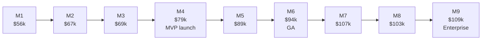

This page adds up [people](/docs/team-and-cost/people-cost), [infrastructure](/docs/team-and-cost/infrastructure-cost), [vendors, AI and tooling](/docs/team-and-cost/vendor-and-ai-cost), and security and compliance. **6 months** takes SellEasy to GA (end of [Phase 3](/docs/roadmap/phase-3-scale-and-intelligence)); **9 months** adds [Phase 4](/docs/roadmap/phase-4-enterprise-and-analytics).

<Callout type="warn" title="Estimates">
All figures are USD estimates. **Low** and **high** combine the low or high salary band with lower or higher non-people spend; they are not independent worst and best cases for every line. See [Assumptions](/docs/team-and-cost/assumptions).
</Callout>

## Summary

<Tabs items={['6 months (to GA)', '9 months (to enterprise release)']}>
<Tab value="6 months (to GA)">

| Scenario | Low | Expected | High | Expected + 12.5% contingency | Range with contingency |
|---|--:|--:|--:|--:|--:|
| **US-heavy** | $785k | $923k | $1,085k | **$1,038k** | $883k – $1,221k |
| **Blended** | $368k | $454k | $567k | **$511k** | $414k – $638k |
| **India-heavy** | $192k | $259k | $352k | **$291k** | $216k – $397k |

</Tab>
<Tab value="9 months (to enterprise release)">

| Scenario | Low | Expected | High | Expected + 12.5% contingency | Range with contingency |
|---|--:|--:|--:|--:|--:|
| **US-heavy** | $1,262k | $1,501k | $1,792k | **$1,688k** | $1,420k – $2,016k |
| **Blended** | $616k | $774k | $988k | **$870k** | $692k – $1,112k |
| **India-heavy** | $330k | $456k | $638k | **$513k** | $372k – $718k |

</Tab>
</Tabs>

## Line items

### People

| Scenario | 6 months (low / expected / high) | 9 months (low / expected / high) |
|---|--:|--:|
| US-heavy | $750k / $866k / $995k | $1,178k / $1,361k / $1,563k |
| Blended | $333k / $398k / $477k | $531k / $634k / $759k |
| India-heavy | $158k / $203k / $262k | $246k / $317k / $409k |

### Non-people (same in every staffing scenario)

| Line | 6 months (low / expected / high) | 9 months (low / expected / high) | Source |
|---|--:|--:|---|
| AWS + Vercel | $6.4k / $10.6k / $17.0k | $13.6k / $22.6k / $36.2k | [Infrastructure cost](/docs/team-and-cost/infrastructure-cost#infrastructure-spend-during-the-build) |
| Vendors (dev, sandbox, pilot) | $8.0k / $16.0k / $28.8k | $15.5k / $31.0k / $55.8k | [Vendor & AI cost](/docs/team-and-cost/vendor-and-ai-cost#vendor-spend-during-the-build-expected) |
| Anthropic Claude | $3.3k / $5.5k / $8.8k | $8.7k / $14.5k / $23.2k | [Claude spend](/docs/team-and-cost/vendor-and-ai-cost#claude-spend-during-the-build-expected) |
| Tooling | $9.8k / $12.2k / $15.9k | $15.5k / $19.4k / $25.2k | [Tooling](/docs/team-and-cost/vendor-and-ai-cost#tooling) |
| Security and compliance | $7.2k / $12.0k / $20.4k | $31.2k / $52.0k / $88.4k | [Security and compliance](/docs/team-and-cost/vendor-and-ai-cost#security-and-compliance-one-off-and-annual) |
| **Non-people total** | **$35k / $56k / $91k** | **$85k / $140k / $229k** | |

Non-people costs are a small share of the total (about 6% for a US-heavy team up to about 31% for an India-heavy team over 9 months) because customers bring their own vendor keys and infrastructure stays at pilot scale during most of the build.

## Month-by-month burn

Expected case, before contingency, in thousands of USD.

<Tabs items={['Blended', 'US-heavy', 'India-heavy']}>
<Tab value="Blended">

| Month | People | Infra | Vendors | Claude | Tooling | Security | **Total** | **Cumulative** |
|---|--:|--:|--:|--:|--:|--:|--:|--:|
| M1 Oct 2026 | 53.0 | 0.6 | 0.5 | 0.2 | 1.4 | — | **55.7** | 55.7 |
| M2 Nov 2026 | 62.0 | 1.2 | 1.5 | 0.4 | 2.0 | — | **67.1** | 122.8 |
| M3 Dec 2026 | 62.0 | 1.5 | 3.0 | 0.6 | 2.0 | — | **69.1** | 191.9 |
| M4 Jan 2027 | 63.0 | 1.8 | 3.0 | 0.8 | 2.1 | 8.0 | **78.7** | 270.6 |
| M5 Feb 2027 | 78.8 | 2.5 | 4.0 | 1.5 | 2.4 | — | **89.2** | 359.8 |
| M6 Mar 2027 | 78.8 | 3.0 | 4.0 | 2.0 | 2.4 | 4.0 | **94.2** | **454.0** |
| M7 Apr 2027 | 78.8 | 3.5 | 5.0 | 2.5 | 2.4 | 15.0 | **107.2** | 561.2 |
| M8 May 2027 | 78.8 | 4.0 | 5.0 | 3.0 | 2.4 | 10.0 | **103.2** | 664.4 |
| M9 Jun 2027 | 78.8 | 4.5 | 5.0 | 3.5 | 2.4 | 15.0 | **109.2** | **773.6** |

</Tab>
<Tab value="US-heavy">

| Month | People | Non-people | **Total** | **Cumulative** |
|---|--:|--:|--:|--:|
| M1 Oct 2026 | 101.3 | 2.7 | **104.0** | 104.0 |
| M2 Nov 2026 | 142.9 | 5.1 | **148.0** | 252.0 |
| M3 Dec 2026 | 142.9 | 7.1 | **150.0** | 402.0 |
| M4 Jan 2027 | 149.2 | 15.7 | **164.9** | 566.9 |
| M5 Feb 2027 | 165.0 | 10.4 | **175.4** | 742.3 |
| M6 Mar 2027 | 165.0 | 15.4 | **180.4** | **922.7** |
| M7 Apr 2027 | 165.0 | 28.4 | **193.4** | 1,116.1 |
| M8 May 2027 | 165.0 | 24.4 | **189.4** | 1,305.5 |
| M9 Jun 2027 | 165.0 | 30.4 | **195.4** | **1,500.9** |

</Tab>
<Tab value="India-heavy">

| Month | People | Non-people | **Total** | **Cumulative** |
|---|--:|--:|--:|--:|
| M1 Oct 2026 | 24.7 | 2.7 | **27.4** | 27.4 |
| M2 Nov 2026 | 33.6 | 5.1 | **38.7** | 66.1 |
| M3 Dec 2026 | 33.6 | 7.1 | **40.7** | 106.8 |
| M4 Jan 2027 | 34.7 | 15.7 | **50.4** | 157.2 |
| M5 Feb 2027 | 38.0 | 10.4 | **48.4** | 205.6 |
| M6 Mar 2027 | 38.0 | 15.4 | **53.4** | **259.0** |
| M7 Apr 2027 | 38.0 | 28.4 | **66.4** | 325.4 |
| M8 May 2027 | 38.0 | 24.4 | **62.4** | 387.8 |
| M9 Jun 2027 | 38.0 | 30.4 | **68.4** | **456.2** |

</Tab>
</Tabs>

*Blended monthly burn, expected, before contingency.* Steady-state burn after GA is about **$80k–$110k per month (blended)**, **$165k–$195k (US-heavy)** and **$40k–$70k (India-heavy)**, before revenue and growth-scale infrastructure.

## Contingency

Hold **10–15%** on top of the expected case. The summary uses **12.5%**.

| Scenario | 6 months at 10% | 6 months at 15% | 9 months at 10% | 9 months at 15% |
|---|--:|--:|--:|--:|
| US-heavy | $1,015k | $1,061k | $1,651k | $1,726k |
| Blended | $499k | $522k | $851k | $890k |
| India-heavy | $285k | $298k | $502k | $524k |

**What contingency is for:** hiring slippage covered by contractors, a vendor contract (for example Bombora) or marketplace fee not in the expected case, extra security work from pen-test findings, and higher LLM usage from successful pilots. Use the **high** case, not contingency, if you already expect US-market rates at the top of the band.

## Funding view

| Question | Blended answer (expected + 12.5%) |
|---|---|
| Cash needed to reach GA | ~$0.51M |
| Cash needed to reach enterprise release | ~$0.87M |
| Runway buffer after month 9 (recommended) | 6 months of steady-state burn ≈ $0.5M–$0.65M |
| Largest single lever | Team location and seniority (see [sensitivity](/docs/team-and-cost/assumptions#sensitivity)) |
| Cheapest meaningful cut | Stop after Phase 3 (saves ~$0.36M blended) or use the [lean team](/docs/team-and-cost/team-plan#alternative-lean-team) |

## Related

- [Team plan](/docs/team-and-cost/team-plan)
- [Roadmap → Timeline](/docs/roadmap/timeline)
- [Assumptions](/docs/team-and-cost/assumptions)
